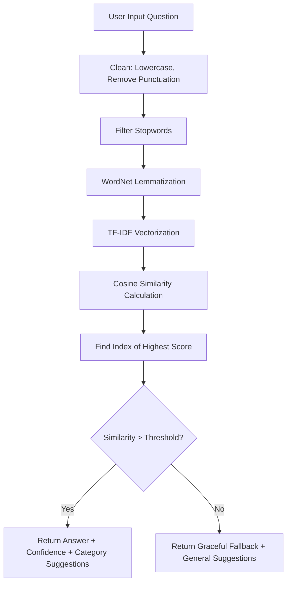

# Project Report: College Student FAQ Chatbot

---

## 1. Project Overview & Abstract

Accessing accurate college information (fees, schedules, curfews, exam policies) can be time-consuming for students who have to sort through bulky PDF handbooks. The **College Student FAQ Chatbot** solves this issue by offering a natural language dialogue interface.

The application ingests a JSON dataset containing 50+ college FAQ pairs. By implementing natural language preprocessing (tokenization, stopword removal, and lemmatization) and converting documents into mathematical vectors using TF-IDF representation, the engine measures the Cosine Similarity of user queries against the database. It instantly returns the most relevant answer, calculates a confidence score, and suggests three related questions, ensuring a highly helpful interactive experience.

---

## 2. Preprocessing & Matching Pipeline

### Technical Details:
1. **Lemmatization**: Unlike stemming (which chops off suffixes crudely), NLTK's `WordNetLemmatizer` uses morphological analysis to return valid dictionary root words (e.g. *studies* and *studying* both map to *study*). This drastically improves matching accuracy.
2. **TF-IDF (Term Frequency - Inverse Document Frequency)**: Assigns weight to terms. Common terms like "the" or "college" receive low weights, while specific terms like "hostel", "revaluation", or "curfew" receive high weights.
3. **Cosine Similarity**: Measures the cosine of the angle between the query vector and the question vectors in a multi-dimensional space, outputting a value between 0 (orthogonal, no match) and 1 (collinear, identical match).

---

## 3. GitHub Repository Description

**Repository Title**: `college-faq-chatbot-tfidf`

**Description**:
> 🎓 An AI-powered FAQ Chatbot for college students built in Python using Streamlit, NLTK, and Scikit-Learn. Uses TF-IDF vectorization and Cosine Similarity to search and match user queries against a database of 50+ FAQ pairs covering Admissions, Academics, Hostel curfew, Fees, and Exams. Features include real-time confidence scores, auto-suggested questions, and conversational history preservation.

---

## 4. LinkedIn Project Description

**Title**: Built an AI-powered College FAQ Chatbot using NLTK & Scikit-Learn

**Post Description**:
> 🚀 Pleased to share the completion of my second internship project as an AI Intern at CodeAlpha: an **AI-powered College FAQ Chatbot**! 🎓
> 
> Manually digging through student handbooks is a thing of the past. This chatbot allows college students to ask administrative or academic questions in plain English and receive instant answers.
> 
> **Key Technical Highlights**:
> 🧹 **Text Preprocessing**: Utilizes NLTK's WordNet Lemmatizer to resolve word roots and filters out English stopwords and punctuation.
> 🧮 **Mathematical Retrieval**: Converts queries and documents into numeric representations using TF-IDF Vectorization and identifies matches using Cosine Similarity.
> 💡 **Context-Aware Suggestions**: Dynamically calculates secondary matches to suggest relevant follow-up questions.
> 💬 **Interactive UI**: Built using Streamlit's native chat modules, featuring typing delay animations, color-coded confidence badges, and resetting options.
> 
> Check out the GitHub repository to see the NLP pipeline in action!
> 
> #Python #NLP #MachineLearning #Chatbots #DataScience #Streamlit #CodeAlpha #Internship

---

## 5. Resume Bullet Points

* **AI Intern | CodeAlpha**
  * Built an AI-powered College FAQ Chatbot utilizing Python, NLTK, and Scikit-Learn, matching student queries against a 52-pair structured dataset with real-time similarity metrics.
  * Designed and implemented an NLP preprocessing pipeline integrating WordNet lemmatization and TF-IDF vectorization, achieving accurate query classification via cosine similarity.
  * Developed a responsive conversational interface using Streamlit, featuring session-state chat history, click-to-submit suggestions, and dynamic confidence thresholds.

---

## 6. Viva Questions and Answers

### Q1: What is TF-IDF and how does it help in this FAQ matching task?
**A**: TF-IDF stands for Term Frequency-Inverse Document Frequency. Term Frequency (TF) counts how often a term appears in a document, while Inverse Document Frequency (IDF) scales down terms that appear very frequently across all documents (e.g. "college", "student") and scales up rare terms (e.g. "curfew", "transcript"). This allows the chatbot to match questions based on their most descriptive keywords rather than common nouns or verbs.

### Q2: Why is Cosine Similarity preferred over Euclidean Distance for text matching?
**A**: Cosine similarity measures the angle between two vectors, focusing on the orientation of the vectors rather than their magnitude. In text retrieval, Euclidean distance is sensitive to document length (a longer document has higher term counts, pushing it further away). Cosine similarity is length-independent, making it ideal for matching short queries with sentences of varying lengths.

### Q3: What is the purpose of Lemmatization in your text cleaning step?
**A**: Lemmatization reduces words to their base or dictionary form (called a lemma) based on their vocabulary and morphological analysis. For example, "ran", "running", and "runs" all map to the base lemma "run". This ensures that if a student asks "Where is the library located?" it matches "What is the library location?" because "located" and "location" are mapped to related roots.

### Q4: How does the suggestion button flow work in your Streamlit application?
**A**: We store suggested questions in `st.session_state.suggestions`. When the user clicks one of the suggested buttons, the app registers the click, retrieves the button text, feeds it into our query processing pipeline as if it were typed, updates the chat history, and triggers `st.rerun()` to update the UI instantly.

### Q5: How do you handle low-confidence queries?
**A**: We set a cosine similarity threshold of `0.25`. If the maximum similarity score for a query falls below this threshold, the chatbot returns a polite fallback response: *"I'm sorry, I couldn't find a direct answer..."* and displays three fallback suggestions containing general, highly-sought-after college FAQs to guide the student.
